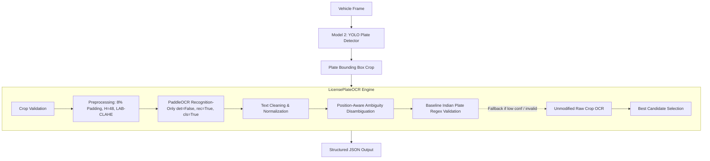

# NETRA — License Plate Optical Character Recognition (OCR)

**Component**: Model 3 — Plate Text Recognition & Validation  
**Module**: `ocr/`  
**Project**: SIH 2026 NETRA (Networked Engine for Traffic Recognition & Analytics)

---

## 1. OCR Architecture Overview

In NETRA, license plate recognition operates on cropped plate regions produced by **Model 2** (the YOLOv8n license plate detector). Because Model 2 detects the bounding box with **96.0% mAP50**, PaddleOCR's internal DBNet text detector is completely bypassed (`det=False`).



### Key Architectural Benefits:
1. **~70% Lower Latency**: Bypassing DBNet text detection reduces per-plate latency to **~80 ms** on CPU.
2. **Zero VRAM Footprint**: Runs strictly on CPU, leaving the full 4.0 GB VRAM of the NVIDIA RTX 3050 Laptop GPU dedicated to YOLO vehicle detection, ByteTrack, OSNet-AIN Re-ID, and YOLO plate detection.
3. **Robust Fallback**: Dual-pass fallback ensures that contrast-enhanced plates benefit from CLAHE without risking edge-padding artifacts on tight crops.

---

## 2. CPU Configuration & OneDNN Workaround

### The Problem
Under `paddlepaddle==3.3.1`, creating an inference configuration via `paddle.inference.Config()` on CPU enables OneDNN by default (`mkldnn_enabled() == True`). In PaddleOCR 2.9.1, `utility.py` omitted calling `config.disable_mkldnn()` when `enable_mkldnn=False`, leaving OneDNN active. This triggered a fatal lookup error inside OneDNN's fused operator backend:

```text
NotFoundError: OneDnnContext does not have the input Filter.
  [operator < fused_conv2d > error]
```

### The Workaround
1. **Engine-Level Patch**: In `paddleocr/tools/infer/utility.py` (line 289), an explicit `else: config.disable_mkldnn()` branch was added.
2. **Initialization Configuration**: `LicensePlateOCR` explicitly sets:
   ```python
   PaddleOCR(
       lang="en",
       use_gpu=False,
       enable_mkldnn=False,   # Critical: Disables OneDNN backend
       use_angle_cls=True,    # 180-deg orientation classifier
       show_log=False         # Suppresses verbose initialization logs
   )
   ```
3. **Inference Call**:
   ```python
   results = ocr.ocr(crop, det=False, rec=True, cls=True)
   ```

---

## 3. Preprocessing Pipeline

The preprocessing pipeline balances contrast improvement against character stroke degradation:

1. **Validation**: Rejects `None`, empty arrays, non-3-channel images, and microscopic crops ($H < 4$ or $W < 8$).
2. **8% Border Padding**: Adds boundary margins via `cv2.BORDER_REPLICATE` so that characters near plate borders are not clipped by receptive fields.
3. **Aspect-Preserved Resizing**: Plate height is normalized to $H = 48$ pixels (`cv2.INTER_CUBIC`), matching the SVTR_LCNet native input height (`3, 48, 320`) while scaling width proportionally.
4. **Gentle LAB-space CLAHE**: Contrast Limited Adaptive Histogram Equalization is applied only to the luminance ($L$) channel (`clipLimit=1.5`, `tileGridSize=(8, 8)`), avoiding aggressive binarization or color artifacts.
5. **Dual-Pass Fallback**: The raw unmodified crop is evaluated if the preprocessed crop yields an invalid format, empty text, or confidence below threshold.

---

## 4. Input & Output Specification

### Input
- **Type**: OpenCV BGR image array (`np.ndarray`)
- **Shape**: `(H, W, 3)`, `dtype=uint8`
- **Content**: Bounding-box crop of the license plate

### Output
```json
{
    "text": "GJ01WC8529",
    "confidence": 0.8646,
    "raw_text": "GJ01WC8529",
    "valid_format": true
}
```

| Field | Type | Description |
|---|---|---|
| `text` | `str` | Cleaned, normalized, and disambiguated registration string |
| `confidence` | `float` | Model confidence score ($0.0000$ to $1.0000$) |
| `raw_text` | `str` | Direct output string from PaddleOCR before correction |
| `valid_format` | `bool` | `True` if text matches baseline Indian format and `confidence >= threshold` |

---

## 5. Indian License Plate Format & Ambiguity Handling

### Baseline Regular Expression
```regex
^[A-Z]{2}[0-9]{1,2}[A-Z]{0,3}[0-9]{4}$
```

- **State Code** (`[A-Z]{2}`): Standard two-letter state/UT abbreviation (e.g., `MH`, `DL`, `GJ`, `KA`, `TN`, `UP`).
- **District/RTO Code** (`[0-9]{1,2}`): One or two digits identifying the registering authority. (Delhi historically uses 1 or 2 digits; all other states strictly use 2 digits).
- **Series Code** (`[A-Z]{0,3}`): Zero to three alphabetic series letters (e.g., `DE`, `WC`, `CAB`, or none).
- **Registration Number** (`[0-9]{4}`): Exactly four numeric digits ($0001$ to $9999$).

### Position-Aware Ambiguity Disambiguation
Character confusion is **never** applied blindly across the string. Instead, character substitutions are applied strictly according to the required character type at that position:

| Character | If Expected Alphabetic | If Expected Numeric |
|:---:|:---:|:---:|
| `O` / `0` | `O` | `0` |
| `I` / `1` | `I` | `1` |
| `Z` / `2` | `Z` | `2` |
| `S` / `5` | `S` | `5` |
| `B` / `8` | `B` | `8` |

**Examples**:
- `MH12DE143O` $\rightarrow$ `O` is in last 4 digits $\rightarrow$ `MH12DE1430` (`valid_format=True`)
- `DL1CA81234` $\rightarrow$ `8` is in series letters $\rightarrow$ `DL1CAB1234` (`valid_format=True`)
- `KA29Z999I` $\rightarrow$ `I` is in last 4 digits $\rightarrow$ `KA29Z9991` (`valid_format=True`)
- `GJ01WC852S` $\rightarrow$ `S` is in last 4 digits $\rightarrow$ `GJ01WC8525` (`valid_format=True`)

---

## 6. Usage & CLI Verification

### Python API
```python
import cv2
from ocr import LicensePlateOCR

# Initialize engine
ocr = LicensePlateOCR(confidence_threshold=0.50)

# Load plate crop
crop = cv2.imread("ocr/test_samples/sample_plate_gj01.jpg")

# Predict
result = ocr.predict(crop)
print(result)
# {'text': 'GJ01WC8529', 'confidence': 0.8646, 'raw_text': 'GJ01WC8529', 'valid_format': True}
```

### Command-Line Interface
```powershell
.\venv\Scripts\python.exe ocr/license_plate_ocr.py ocr/test_samples/sample_plate_gj01.jpg
```

### Unit Tests
```powershell
.\venv\Scripts\python.exe -m unittest ocr/test_license_plate_ocr.py
```

---

## 7. Known Limitations & Edge Cases

1. **Two-Line (Stacked) License Plates**:
   - Two-line plates (common on two-wheelers, auto-rickshaws, and commercial trucks) have the state/district on the upper line and series/number on the lower line.
   - SVTR_LCNet recognition-only processes horizontal crops. When two-line plates are fed without splitting, characters may be recognized with lower confidence or concatenated.
   - *Mitigation in Phase 3B*: Plate line segmentation (splitting upper and lower lines before recognition) will be implemented for high aspect-ratio ($W/H < 2.5$) square crops.
2. **Specialized Vehicle Registrations**:
   - The baseline regex `^[A-Z]{2}[0-9]{1,2}[A-Z]{0,3}[0-9]{4}$` represents civilian/transport standard plates.
   - It does not cover:
     - **Bharat Series (BH)**: `YYBH####XX` (e.g. `22BH1234AA`)
     - **Military Vehicles**: Upward arrow followed by year and serial (e.g. `↑21D123456`)
     - **Diplomatic/Consular**: `##CD##` or `##CC##`
     - **Temporary Plates**: `YY-TEMP-####`
3. **Non-Standard & Fancy Fonts**:
   - Plates with regional script (Devanagari/Kannada/Tamil), decorative fonts, or illegal emblems may require fine-tuning of the recognition dictionary.
