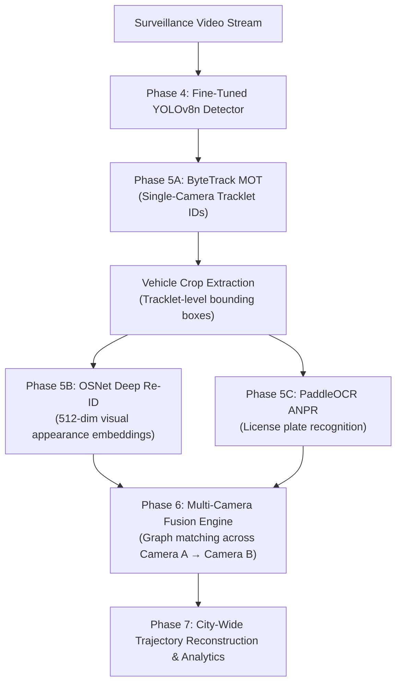

# Phase 5A: Single-Camera Vehicle Tracking with ByteTrack

This directory implements the **Single-Camera Multi-Object Tracking (MOT)** module for the **SIH 2026 AI Engine** project. It combines our fine-tuned 6-class YOLOv8n detector with the **ByteTrack** association algorithm to maintain persistent, unique identities for every vehicle passing through a surveillance camera view.

---

## 1. What ByteTrack Does

Traditional trackers (such as standard SORT or DeepSORT) discard all detection bounding boxes with confidence scores below a fixed threshold (e.g. $< 0.40$). In real-world Indian traffic surveillance, vehicles frequently experience:
* Partial occlusion behind buses, trucks, or signboards.
* Motion blur at high speeds or in low lighting.
* Challenging camera angles and perspective foreshortening.

Discarding these lower-confidence detections causes the tracker to lose the vehicle, resulting in **track fragmentation** and **identity switches (ID switches)**.

### ByteTrack's Core Innovation (Two-Stage Association)
ByteTrack solves this problem by retaining low-confidence detections and associating them in two stages using a **Kalman filter** motion model:
1. **First-Stage Association (`track_high_thresh = 0.40`)**:
   * High-confidence detections are matched to existing tracklets using spatial motion prediction (IoU distance) via the Hungarian algorithm.
2. **Second-Stage Association (`track_low_thresh = 0.10`)**:
   * Unmatched existing tracklets are matched against the remaining *low-confidence* detections $[0.10, 0.40)$.
   * Because true occluded vehicles typically produce lower confidence rather than vanishing completely, this second stage recovers the vehicle and preserves its Track ID without introducing false background tracklets.
3. **New Track Initialization (`new_track_thresh = 0.45`)**:
   * Only high-confidence unmatched detections can spawn a brand new tracklet.

---

## 2. Why Single-Camera Tracking is Required for SIH 2026

In the complete SIH 2026 problem statement (*"City-Wide AI Engine for Multi-Camera ANPR Trajectory Tracking and Urban Traffic Analytics"*), tracking serves as the critical bridge between frame-level detection and city-wide intelligence:

1. **Eliminating Duplicate Vehicle Counting**: Detection alone counts a car 30 times every second. Tracking aggregates all frame detections into a **single persistent vehicle entity** (`ID: 12`).
2. **Smooth Trajectory & Speed Estimation**: By linking centroids $(c_x, c_y)$ over time, the system computes lane discipline, travel direction, and average speed.
3. **Temporal Multi-Frame ANPR Fusion**: Rather than running OCR on a single blurry frame, tracking allows cropping the license plate across multiple consecutive frames and selecting the highest-confidence reading.
4. **Prerequisite for Vehicle Re-ID**: Cross-camera Re-ID requires stable tracklets containing multiple crops of the same vehicle from different angles to extract robust visual embeddings.

---

## 3. Directory Structure

```text
tracking/
├── bytetrack_tracker.py       # Main frame-by-frame tracking engine
├── tracker_config.yaml        # Tuned ByteTrack hyperparameters
├── __init__.py                # Package initialization marker
└── README.md                  # Module documentation (this file)
```

---

## 4. How to Run the Tracker

### Command-Line Arguments:
| Argument | Type | Default | Description |
|---|:---:|:---:|---|
| `--source` | string | `data/videos/test.mp4` | Path to input traffic video file |
| `--model` | string | `runs/vehicle_detection/vehicle_yolov8n_uvh26/weights/best.pt` | Path to fine-tuned YOLOv8n detector |
| `--tracker` | string | `tracking/tracker_config.yaml` | Path to ByteTrack configuration YAML |
| `--conf` | float | `0.40` | Base detection confidence cutoff |
| `--imgsz` | integer | `640` | Input resolution for YOLO detector |
| `--device` | string | `0` (or `cpu`) | GPU index (`0` for RTX 3050 4GB) |
| `--output` | string | `runs/tracking/traffic_test_bytetrack.mp4` | Path to output annotated MP4 video |
| `--no-display`| flag | `False` | Run in headless mode without GUI window |

---

## 5. Execution Examples

### Example 1: Headless Tracking Run (Recommended for Testing & Benchmarks)
```powershell
.\venv\Scripts\python.exe tracking/bytetrack_tracker.py --source data/videos/test.mp4 --no-display
```

### Example 2: Interactive Tracking with GUI Display (Press 'q' to exit)
```powershell
.\venv\Scripts\python.exe tracking/bytetrack_tracker.py --source data/videos/test.mp4
```

### Example 3: Custom Video & Higher Confidence Cutoff
```powershell
.\venv\Scripts\python.exe tracking/bytetrack_tracker.py --source data/videos/junction1.mp4 --conf 0.45 --output runs/tracking/junction1_tracked.mp4 --no-display
```

---

## 6. Output Format

### 1. Video Output (`runs/tracking/*.mp4`)
* Preserves original source video resolution and FPS.
* **Bounding Boxes**: Color-coded by vehicle class.
* **Label Banners**: `<class_name> | ID:<track_id> | <conf>` (e.g. `car | ID:12 | 0.87`).
* **Motion Trajectory Tails**: 30-frame smoothed centroid trail displaying vehicle trajectory on the road.
* **Diagnostics HUD**: Frame progress, real-time FPS, active track count, and cumulative unique track counter.

### 2. Console Telemetry Report
```text
==============================================================================
BYTE TRACK VEHICLE TRACKING TELEMETRY REPORT
==============================================================================
  Input Video File        : D:\...\data\videos\test.mp4
  Output Annotated Video  : D:\...\runs\tracking\traffic_test_bytetrack.mp4
  Video Native Resolution : 918x972 @ 10.00 FPS
  Total Video Frames      : 20
  Processed Frames Count  : 20
  Total Tracking Duration : 0.85s (23.5 avg processing FPS)
  Confidence Threshold    : 0.40
  Tracking Algorithm      : ByteTrack (Custom: tracker_config.yaml)
  Total Cumulative Detections : 1,040
  Total Unique Vehicle IDs    : 52
------------------------------------------------------------------------------
  Vehicle Class    Unique Track IDs     Total Frame Detections
------------------------------------------------------------------------------
  car              18                   360
  motorcycle       16                   320
  auto_rickshaw    10                   200
  bus               5                   100
  truck             1                    20
  van               2                    40
==============================================================================
[SUCCESS] Tracked video output saved to: runs/tracking/traffic_test_bytetrack.mp4
==============================================================================
```

---

## 7. Current Limitations

1. **Single-Camera Scope**: Track IDs (`ID:12`, `ID:23`) are valid strictly within the camera view being processed. If the vehicle drives into a second camera down the road, it will receive a new single-camera Track ID.
2. **Visual Re-Identification Absent**: ByteTrack relies exclusively on spatial position and Kalman filter motion prediction. If a vehicle stops at a red light and is fully blocked by a large container truck for more than `track_buffer` (30 frames), it may be assigned a new ID when re-emerging.
3. **Severe Crowding**: In extremely dense Indian intersections with interweaving motorcycles and auto-rickshaws, pure IoU matching can occasionally swap IDs during tight physical overlaps.

---

## 8. Roadmap: Connection to Phase 5B (Re-ID) and Phase 6 (Trajectory Tracking)

ByteTrack provides the exact foundational inputs required for the next surveillance phases:



1. **Tracklet Crop Extraction**: Every active `track_id` accumulates high-resolution crops of the vehicle.
2. **Deep Appearance Feature Extraction (Re-ID)**: A lightweight Re-ID backbone (e.g. OSNet-AIN) will extract a 512-dimensional visual embedding for each tracklet.
3. **Cross-Camera Trajectory Graph**: The multi-camera trajectory tracking module matches embeddings and license plates across non-overlapping camera feeds to reconstruct the complete city-wide vehicle journey.
